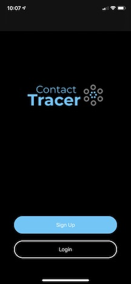
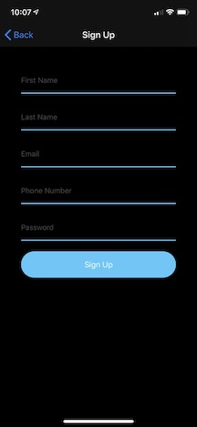
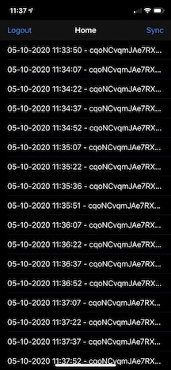
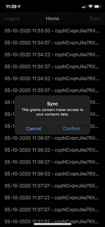

# Contact Tracer App

*This is my final project for UCLA's CS 205 Health Analytics course.*

## Introduction

Contact Tracer is a contact tracing system designed to combat the transmission of infectious diseases and pandemics. Contact Tracer is designed to assist traditional contact tracing by automatically logging an individual's contacts by detecting them via Bluetooth signals. Data is stored securely on a users device and is shared only where the user grants explicit permission.

Contact Tracer is divided into two parts: 
- iOS App
- Analytics.

This repository covers the iOS App. You can view Analytics [here](https://github.com/thomascpan/contact-tracer-analytics).

## Description

Contact Tracer App is an iOS app that automatically detect all the people a person comes into contact with throughout a given time period. Using Bluetooth signals, it detects and logs all nearby devices that have the app installed. The user then has the option of uploading their data for contact tracing purposses.

## Features

- Signup and Authentication
- Contact Logging
- Sync

## Preview

*Fig. 1: Contact Tracer Welcome Page: signup or login*

*Fig. 2: Signup information is encrypted and stored securely used solely for notifying individuals who have potentially been infected*

*Fig. 3: Contact Tracer Home Page shows a log of recent contacts*

*Fig. 4: Users control their own data and can sync/upload their data to the backend for contact tracing purposes*

## Misc.

- Frontend:
    - Swift 5
- Backend:
    - Firebase (Auth/DB)
    - Python Server (Analytics)

## Instructions

Open "contact-tracer.xcworkspace" via xcode. Run app on xcode's device simulator or conntected iOS devices.

## Author(s)
- Thomas Pan